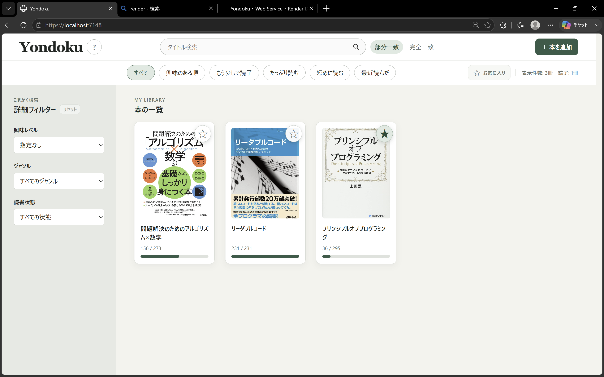
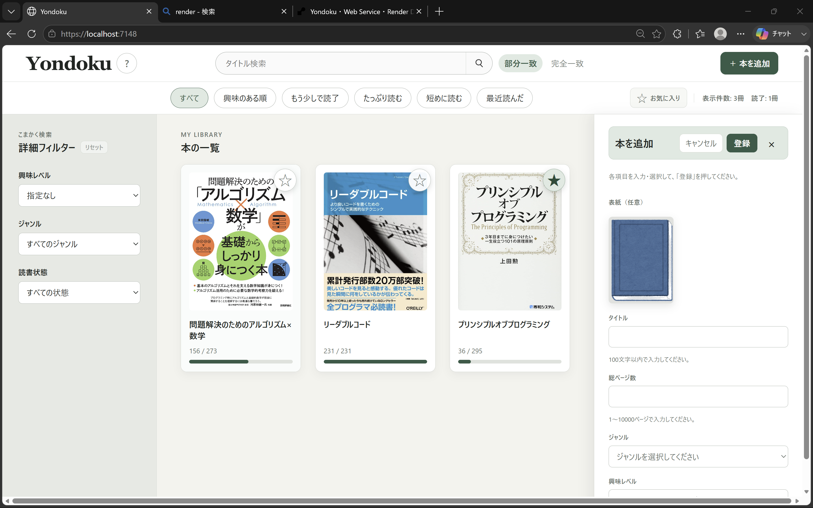
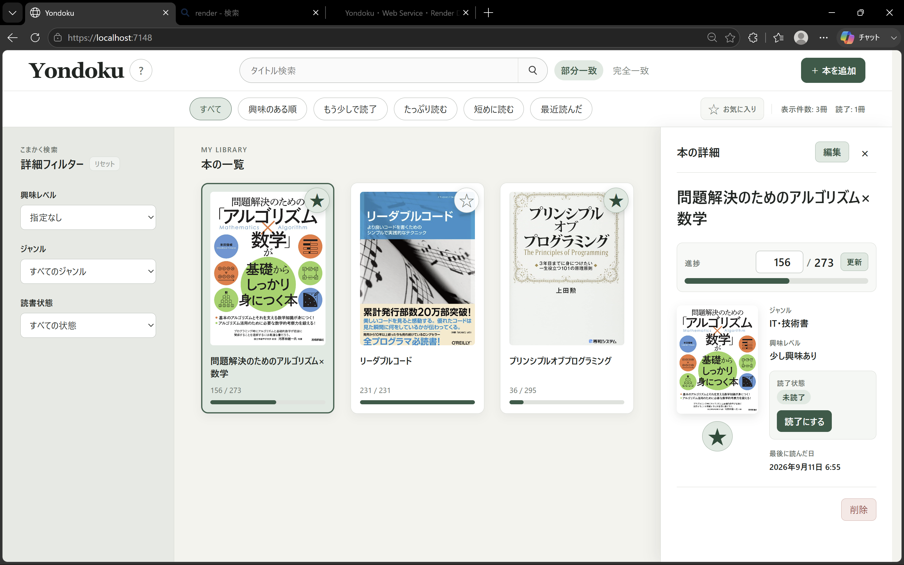
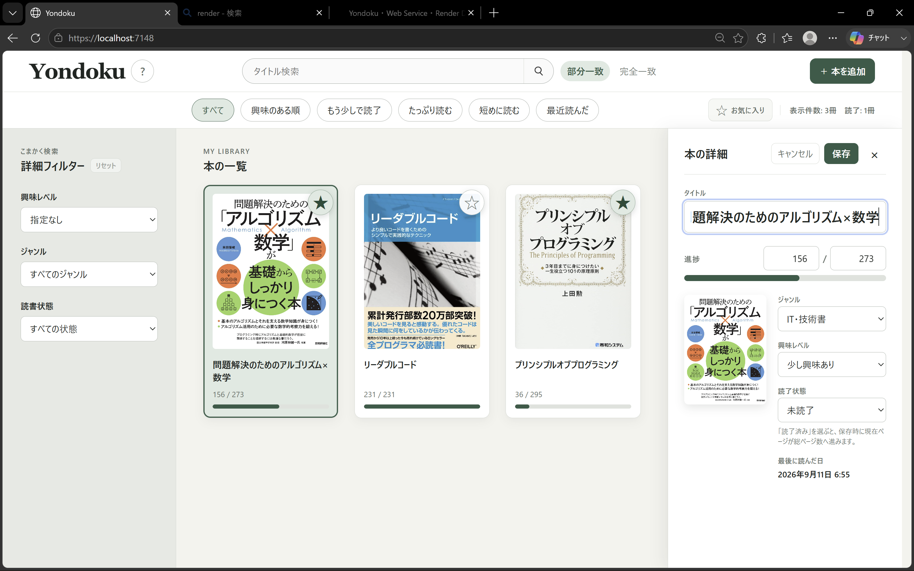
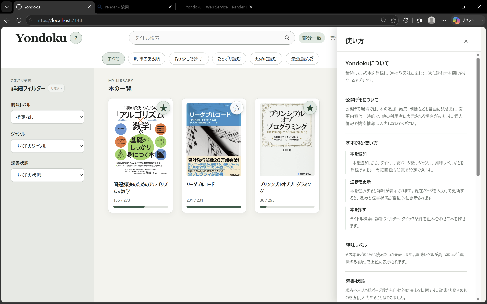

# Yondoku

積読している本を登録し、興味や読書進捗に応じて目的の本をすぐに探せる積読管理Webアプリです。

本の登録や進捗管理だけでなく、興味レベル、読書状態、お気に入り、ページ数、最後に読んだ日時などを利用して本を絞り込めます。

既存の積読管理アプリを利用した際に、自分には必要のない機能が多く、目的の本を探すまでの操作が複雑だと感じたことから、必要な機能に絞ったシンプルな積読管理アプリとして開発しました。

## 公開デモ

<https://yondoku.onrender.com>

公開デモでは、本の追加、編集、削除などの機能を実際に試すことができます。

> 公開デモ上のデータは共有されています。
> 追加や編集を行った内容が、他の利用者にも表示される場合があります。
> 個人情報や機密情報は入力しないでください。

---

## 画面

本の一覧、検索、クイック条件、詳細フィルター、本の詳細を1画面から操作できます。

---

## 開発した背景

自分自身に積読している本があり、次に読む本や興味のある本を探しやすくしたいと考えたことが開発のきっかけです。

既存の積読管理アプリも試しましたが、自分には必要のない機能が多く、単純に本を登録して探したい場合でも操作が複雑に感じることがありました。

そこでYondokuでは、積読管理に必要だと考えた機能を中心に構成し、できるだけ少ない操作で本を探せることを重視しました。

また、この開発にはC#の学習に加えて、Webフレームワークを利用した開発、JavaScriptとの連携、データベースによる永続化、Webアプリのデプロイまでを経験する目的もあります。

---

## 主な機能

### 本の登録

タイトル、総ページ数、ジャンル、興味レベル、表紙画像などを登録できます。

表紙画像は端末からアップロードできます。

### 読書進捗の管理

現在読んでいるページを入力することで、本ごとの進捗を記録できます。

一覧画面では現在ページ数と総ページ数に加えて、進捗をバーで確認できます。

読書状態は現在ページ数と総ページ数をもとに管理されるため、利用者が毎回読書状態を手動で変更する必要がありません。

### 本の詳細表示

一覧から本を選択すると、画面右側に詳細情報が表示されます。

タイトル、進捗、ジャンル、興味レベル、読書状態、最後に読んだ日時などを確認できます。

### 本の編集

登録済みの本は詳細画面から編集できます。

タイトル、ページ数、ジャンル、興味レベルなどを変更できます。

本の削除や読了状態の変更にも対応しています。

### お気に入り

本ごとにお気に入りをオンまたはオフで設定できます。

お気に入りの本だけを表示することもできます。

---

## 本を探す機能

Yondokuでは、登録した本を後から探しやすくすることを重視しています。

### タイトル検索

タイトルによる検索に対応しています。

- 部分一致
- 完全一致

用途に応じて検索方法を切り替えられます。

### 詳細フィルター

画面左側の詳細フィルターから、複数の条件を指定できます。

主な条件は次の通りです。

- 興味レベル
- ジャンル
- 読書状態

複数条件を組み合わせることで、本の数が増えても目的の本を絞り込めます。

### クイック条件

利用頻度が高いと考えた検索条件は、画面上部からワンクリックで利用できます。

- すべて
- 興味のある順
- もう少しで読了
- たっぷり読む
- 短めに読む
- 最近読んだ

詳細フィルターを毎回設定しなくても、そのときの目的に合わせてすぐに本を探せるようにしています。

### 興味レベル

本をどのくらい読みたいかを5段階で管理します。

興味レベルを利用することで、積読している本の中から特に興味のある本を見つけやすくしています。

### 最後に読んだ日時

読書を進めた日時を記録し、最近読んだ本を探せるようにしています。

---

## 使い方

アプリ内にも簡単な使い方を確認できるヘルプ画面を用意しています。

基本的な操作は次の流れです。

1. 本を登録する
2. 読んだところまでページ数を更新する
3. 興味レベルやジャンルなどで本を管理する
4. タイトル検索、詳細フィルター、クイック条件から本を探す

複雑な設定を行わなくても使えることを意識しています。

---

## 技術構成

| 分類 | 使用技術 |
| --- | --- |
| バックエンド | C# |
| Webフレームワーク | ASP.NET Core |
| ORM | Entity Framework Core |
| データベース | SQLite |
| フロントエンド | HTML |
| スタイル | CSS |
| フロントエンド処理 | JavaScript |
| API通信 | Fetch API |
| デプロイ | Render |
| バージョン管理 | Git |
| リポジトリ管理 | GitHub |

---

## 構成と設計で意識したこと

### 必要な機能から順番に実装する

開発開始時点からすべての機能を一度に作るのではなく、アプリの根幹となる機能から順番に実装しました。

本のデータ管理や検索などの中心機能を先に作り、その後に画面、データベース、デプロイなどを追加しています。

この進め方によって、開発途中でも完成範囲を調整できるようにしました。

### 不要な機能を増やさない

Yondokuでは、機能数を増やすことよりも、積読している本を管理して探すという目的を優先しました。

既存サービスを利用した際に感じた、機能が多いことで操作が複雑になる問題を避けるためです。

そのため、第一完成版では必要性が低いと判断した機能を追加せず、検索、進捗管理、編集などの中心機能に絞っています。

### 状態を分かりやすい指標で表す

本を探す際に利用する情報として、次のような直感的に理解しやすい指標を用意しました。

- 興味レベル
- 読書状態
- お気に入り
- 読書進捗
- ページ数
- 最後に読んだ日時

これらを検索やクイック条件に利用することで、条件を細かく入力しなくても目的に近い本を探せるようにしています。

---

## 開発で苦労したこと

### アルゴリズムや処理方法を自分で考えること

単純にコードを書くことだけではなく、本の状態をどのように管理するか、どの条件で検索するか、それぞれの処理をどこが担当するかを自分で設計する必要がありました。

特に、機能を増やしても処理が分かりづらくならないように、データと処理の関係を考えながら設計することに苦労しました。

### フレームワークを理解しながら開発すること

ASP.NET Coreを利用したWeb開発では、C#のコードだけでなく、HTTPリクエスト、Web API、依存性注入、データベース、フロントエンドとの通信など、複数の仕組みが関係します。

コードを動かすだけではなく、それぞれが何を担当しているのかを理解しながら開発を進めることを意識しました。

### デプロイまでの流れを理解すること

ローカル環境で動作するアプリをWeb上で公開するには、開発環境とは異なる点についても考える必要がありました。

Renderへのデプロイまで行うことで、実装したWebアプリを外部から利用できる状態にするまでの流れを経験しました。

---

## 問題を整理するために行ったこと

理解できていない処理については、コードだけを見続けるのではなく、処理の流れをノートに図として書き起こしました。

例えば、Webアプリ内でデータがどのように移動するかを整理し、それぞれの処理がどの役割を持っているかを確認しながら学習しました。

また、根幹となる機能と、その機能を成立させるために必要な機能を整理してから実装することで、一度に扱う問題を増やしすぎないようにしました。

---

## この開発を通して学んだこと

Yondokuの開発では、C#の文法やコードの書き方だけではなく、Webアプリ全体がどのような仕組みで動作しているのかを学ぶことができました。

特に、ASP.NET Coreのようなフレームワークを利用してアプリケーションを構築する考え方や、フロントエンド、バックエンド、データベースを連携させる方法について理解を深めることができました。

また、ローカルで完成させるだけではなく、Renderを利用して実際にWeb上へデプロイしたことで、Webアプリを公開するまでの一連の流れを経験できました。

ただ、Webアプリではなく、DLして配布できる形式の方が今回のものに適していたかもと開発後に思いました。とにかくWebアプリを作りたいという思いで完結しましたが適材適所だなと感じました。

---

## 開発期間

**2026年8月5日 〜 2026年8月31日**

C#を中心に、ASP.NET Core、JavaScript、Entity Framework Core、SQLite、デプロイなどを学習しながら開発しました。

---

## 公開デモについて

公開デモはこちらから利用できます。

<https://yondoku.onrender.com>

公開デモは機能を確認するための環境です。

登録、編集、削除したデータは一時的なものであり、他の利用者にも表示される場合があります。

個人情報や機密情報などは登録しないでください。
